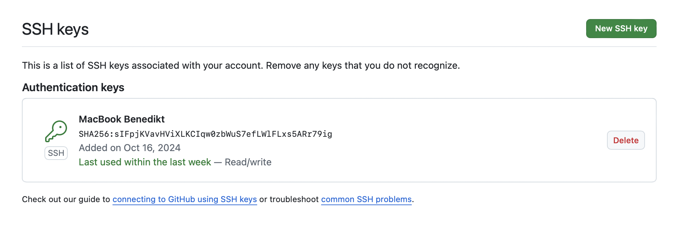

# Proof of Environment Setup

This document provides proof of the steps taken to set up the development environment and implement security measures for the project.

## 1. Git Installation

Git was successfully installed and configured. (No documentation required for this step.)

## 2. SSH Key Pair Created and Uploaded to GitHub

- A new SSH key pair was created and authenticated using the following commands:

```bash
ssh-keygen -t ed25519 -C "benedikt.zanker@yahoo.de"
cat ~/.ssh/id_ed25519.pub
eval "$(ssh-agent -s)"  
ssh-add ~/.ssh/id_ed25519
ssh -T git@github.com 
```


## 3. Configured Name and Email for Git Commits

```bash
git config --global user.name Benedikt Zanker
git config --global user.email benedikt.zanker@yahoo.de
```
## 4. GitHub Profile Updated

- Profile picture uploaded.
- Name and location (city and university) added.

- [Screenshot of the updated profile](./screenshots/Profile.png)


## 5. Two-Factor Authentication Enabled

Two-factor authentication was successfully enabled.

- Method used: Authenticator app (e.g., Google Authenticator)
- Recovery codes have been securely stored.

- [Screenshot of 2FA activation](./screenshots/Two-FactorAuthentication.png)