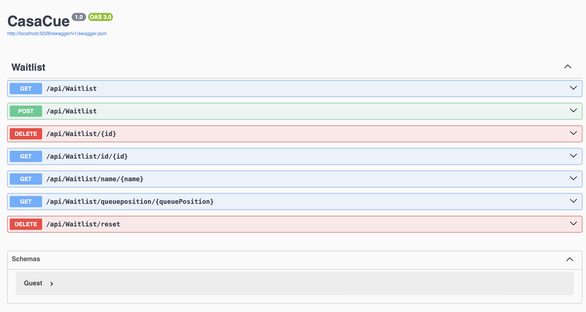

# Hito 3: Microservices 

## Framework Selection and Justification

For the development of the microservice, **ASP.NET Core** was selected as the framework. This choice aligns with the technology stack chosen at the project's inception, making it a natural continuation of the established backend implementation. ASP.NET Core is widely recognized as the standard framework for building scalable, cloud-ready web APIs in the .NET ecosystem.

### Key reasons for this selection include:

- **RESTful API Support**: ASP.NET Core provides robust tools for creating and managing RESTful APIs, aligning perfectly with the requirements of the CasaCue project.
- **Integration with Existing Tools**: It seamlessly integrates with the project's Continuous Integration setup (GitHub Actions) and testing frameworks (xUnit).
- **Scalability and Performance**: Optimized for cloud deployments, ASP.NET Core ensures high performance and scalability, essential for a dynamic application like CasaCue.
- **Community and Ecosystem**: As an industry-standard, ASP.NET Core is backed by extensive documentation, a large developer community, and a wealth of libraries and extensions.
- **Practical Experience**: I have also gained hands-on experience using ASP.NET Core during my role as a Werkstudent, where it proved to be reliable and efficient for building web-based applications.

This framework was selected early in the project planning phase to ensure a unified and efficient development process across all project milestones.


## API Design


The CasaCue API is a RESTful service designed to manage restaurant waitlists. The API provides endpoints for adding guests, retrieving the waitlist, and managing guest data by their ID, name, or position. It supports dynamic updates to guest positions and provides detailed information about each guest, including their group size and position in the waitlist.

The API is built using **ASP.NET Core**, following a modular architecture:
- **Models**: Defines the structure of the guest data.
- **Services**: Handles the core business logic for waitlist management.
- **Controllers**: Exposes RESTful endpoints to interact with the waitlist.

---

### Implemented Features

#### 1. Add a Guest
**Endpoint**: `POST /api/waitlist`  
Adds a new guest to the waitlist.  
- **Input**: A JSON object with the guest's `Id`, `Name`, and `GroupSize`.
- **Output**: A confirmation of the added guest.

#### 2. Get the Entire Waitlist
**Endpoint**: `GET /api/waitlist`  
Retrieves the entire waitlist, including:
- Guest `Id`
- `Name`
- `GroupSize`
- `Position`

#### 3. Remove a Guest
**Endpoint**: `DELETE /api/waitlist/{id}`  
Removes a guest from the waitlist by their unique `Id`.

#### 4. Get Guest by ID
**Endpoint**: `GET /api/waitlist/id/{id}`  
Fetches detailed information about a guest using their `Id`.

#### 5. Get Guests by Name
**Endpoint**: `GET /api/waitlist/name/{name}`  
Fetches all guests with a matching `Name`. Supports multiple matches.

#### 6. Get Guest by Position
**Endpoint**: `GET /api/waitlist/position/{position}`  
Fetches the guest at a specific position in the waitlist.

#### 6. Get Guest by Position
**Endpoint**: `DELETE /api/waitlist/reset`  
Resets the waitlist.

### Swagger Integration

The CasaCue API uses **Swagger**, a standard tool in .NET Core for API documentation and testing. It provides an interactive interface to view all API endpoints, see their input/output details, and test them directly from the browser.




## Test Cases

To ensure reliability, the test cases for the WaitlistService were revised and adapted to cover the new functionalities. These unit tests validate critical features such as retrieving guests by ID, name, or queue position, and ensure the correct handling of invalid inputs.

In addition to unit tests, integration tests were introduced to thoroughly test the API endpoints. These tests simulate real-world usage by sending HTTP requests to the API and validating the responses. To enable integration testing, the package Microsoft.AspNetCore.Mvc.Testing was added.

This package was chosen because it seamlessly integrates with the ASP.NET Core infrastructure, allowing for the creation of a fully functional, isolated test server. It enables realistic API testing while maintaining control over the test environment, ensuring reliable and reproducible results.

Furthermore, the integration tests interact with the API and ensure that all activities are logged appropriately in the log file. This provides a comprehensive trace of API usage, which is invaluable for debugging and monitoring. The implementation of the logging system and its integration with the API endpoints is explained in the following section.


## **Log File Implementation**

To track API activities and support debugging, a logging system using **Serilog** was implemented. This system captures events such as API requests, errors, and test activities, saving them to a log file.

### **Why Serilog?**
Serilog was chosen for its:
- **Flexibility:** Supports logging to console and file.
- **Structured logging:** Provides meaningful and parseable logs.
- **Ease of use:** Seamless integration with .NET applications.

### Configuration in Programm.cs
```C#
Log.Logger = new LoggerConfiguration()
    .WriteTo.Console()
    .WriteTo.File("logs/log-.txt", rollingInterval: RollingInterval.Day, retainedFileCountLimit: 10)
    .CreateLogger();
    
builder.Host.UseSerilog();
```
This configuration ensures a new log file is created daily while automatically deleting older files once the total exceeds 10 in the folder. Additionally, all logs are also output to the console for real-time monitoring.

In the **Controller** file, I included meaningful logging, such as Warnings or Inforamtion. E.g.:
Log.Warning("Attempt to add a guest with an empty ID.");
Log.Information("Guest {Name} with ID {Id} removed from the waitlist.", guest.Name, id);

This configuration ensures a new log file is created daily while automatically deleting older files once the total exceeds 10 in the folder.

This information is stored in daily log files, located in the Logs folder within the CasaCue directory as well as in the Console.

For further details about the project, refer to the main [README](../README.md).