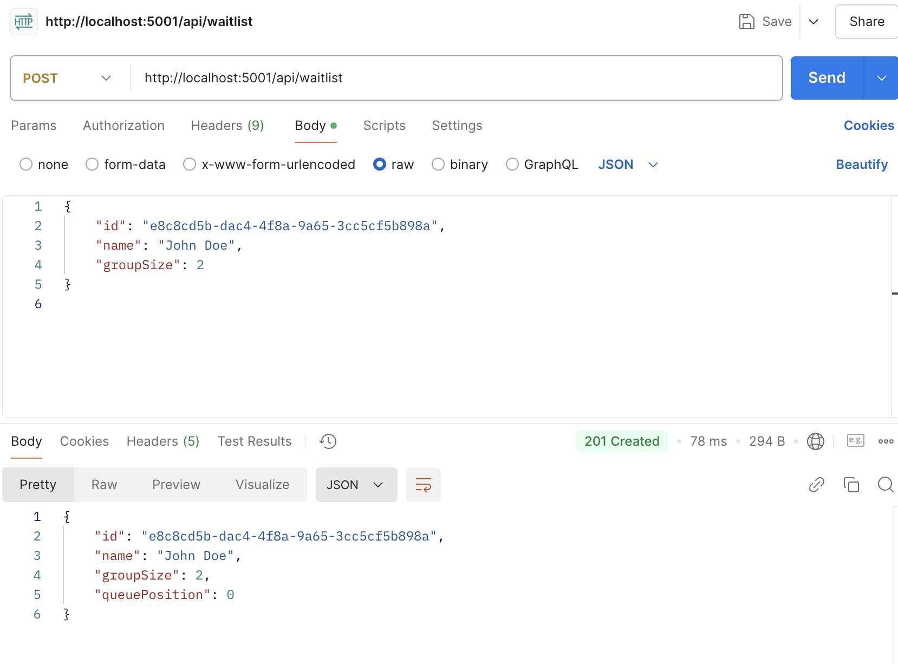
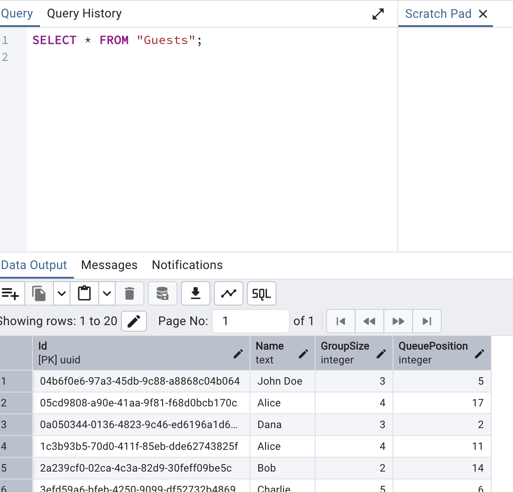

# Documentation Summary

## Objective

My goal for this milestone was to containerize the CasaCue waitlist API, Database and Log In System, test its functionality, and ensure it operates as expected.


### 1. Setting Up the Folder Structure

To ensure a well-organized project, I established a clear folder structure that separates different components of the application. The backend, which contains the main API, is isolated in its own directory, and I prepared placeholders for other services such as the database with we configure after the next step. The structure looks like this:

- **`backend/`**: Contains Docker configuration for the Waitlist API.
- **`database/`**: Placeholder for database integration.
- **`auth/`**: Contains Docker configuration for the Waitlist API.

In the Main app i add:
- **`docker-compose.yaml`**: Configuration for orchestrating multiple services. (Im überegordeten Order )


## Backend Container 

### 2. Creating the Backend Container

I created a `Dockerfile` to containerize the backend API. The `Dockerfile` specifies the base image and the steps required to package the application. The key steps are Dokumenteted directly in the Dokument 
[Dokerfile](../docker/backend/Dockerfile).


I published the backend using the .NET CLI:
```bash
dotnet publish -c Release -o publish
```
This generated the required files, which I then included in the container. I configured the container to expose the API on port 8080.

### 3. Running the Backend Container Locally

I started the backend container using Docker with the following command:
```bash
docker run -p 5001:8080 casacue-backend
```
This mapped port 8080 from inside the container to port 5001 on the host system, making the API accessible via http://localhost:5001.

### 4. Testing the API with Postman

I tested the API endpoints using Postman:

#### POST /api/waitlist:
I used this endpoint to add a guest to the waitlist. The following JSON payload was sent:
```json
{
    "id": "e8c8cd5b-dac4-4f8a-9a65-3cc5cf5b898a",
    "name": "John Doe",
    "groupSize": 2
}
```
The API successfully added the guest to the waitlist.



#### GET /api/waitlist:
I used this endpoint to retrieve the current waitlist, which included the newly added guest:
```json
[
    {
        "id": "e8c8cd5b-dac4-4f8a-9a65-3cc5cf5b898a",
        "name": "John Doe",
        "groupSize": 2
    }
]
```

## Integrate the Database

### 1. Installing PostgreSQL

To set up a PostgreSQL database, the following steps were taken:

1. **PostgreSQL Installation**:
   - PostgreSQL was installed using **Homebrew** on macOS:
     ```bash
     brew install postgresql
     ```

2. **Starting the PostgreSQL Service**:
   - After installation, the PostgreSQL service was started:
     ```bash
     brew services start postgresql
     ```

3. **Verifying PostgreSQL Installation**:
   - The `psql` CLI was used to confirm that PostgreSQL was running:
     ```bash
     psql postgres
     ```

### 2. Configuring the Database

1. **Database and User Setup**:
   - A new database and user were created using `psql`:
     ```sql
     CREATE DATABASE casacue_db;
     CREATE USER casacue WITH PASSWORD 'password';
     GRANT ALL PRIVILEGES ON DATABASE casacue_db TO casacue;
     ```

2. **Testing the Connection**:
   - Verified that the new user and database could be accessed:
     ```bash
     psql -U casacue -h localhost -d casacue_db
     ```

### 3. Connecting the Backend to PostgreSQL

1. **Connection String**:
   - A connection string was added to the `appsettings.json` file:
     ```json
     {
       "ConnectionStrings": {
         "DefaultConnection": "Host=localhost;Database=casacue_db;Username=casacue;Password=password"
       }
     }
     ```

2. **Configuring the `DbContext`**:
   - The `ApplicationDbContext` class was defined to represent the database structure:
     ```csharp
     namespace CasaCue.Data
     {
         public class ApplicationDbContext : DbContext
         {
             public ApplicationDbContext(DbContextOptions<ApplicationDbContext> options) : base(options) { }

             public DbSet<Guest> Guests { get; set; }
         }
     }
     ```

3. **Registering the `DbContext` in `Program.cs`**:
   - The `ApplicationDbContext` was registered in the service container to allow dependency injection:
     ```csharp
      builder.Services.AddDbContext<ApplicationDbContext>(options =>
      options.UseNpgsql(dbConnectionString)
           .LogTo(Console.WriteLine, LogLevel.Information));
     ```

---

### 4. Creating the Database Schema

1. **Migration Creation**:
   - A migration was created to define the database schema:
     ```bash
     dotnet ef migrations add InitialCreate
     ```

2. **Applying the Migration**:
   - The migration was applied to the PostgreSQL database:
     ```bash
     dotnet ef database update
     ```

3. **Verifying the Schema**:
   - The database schema was confirmed using `psql`:
     ```sql
     \dt
     ```

---

### 5. Viewing and Managing the Database

To make it easier to view and manage the database, **pgAdmin** was installed:

1. **pgAdmin Installation**:
   - pgAdmin was downloaded and installed from the official website: [pgAdmin Download](https://www.pgadmin.org/download/).

2. **Connecting to PostgreSQL**:
   - pgAdmin was used to connect to the database using the following credentials:
     - **Host:** `localhost`
     - **Port:** `5432`
     - **Database:** `casacue_db`
     - **Username:** `casacue`
     - **Password:** `password`

3. **Viewing Tables**:
   - The table `Guests` was selected in pgAdmin to request its contents.


## New Function Authentification.

# Authentication Logic and Logging System

To implement the third container, an **authentication logic** was added, enabling user registration, login, and token-based access to protected routes. The logging system using **Serilog** tracks key actions for transparency and debugging.

## File Structure and Responsibilities

### 1. **AuthController.cs**
- Handles **API endpoints** for user authentication:
  - `POST /register`: Registers a new user and logs actions like successful registration or existing users.
  - `POST /login`: Authenticates users and generates a JWT token. Logs successful and failed login attempts.
  - `GET /protected`: A protected endpoint accessible only to authenticated users. Logs successful accesses.
  - `DELETE /cleanup/{username}`: Deletes a specific user from the database.
- Leverages **Serilog** for logging user activities and warnings.

### 2. **User.cs**
- Defines the **User model**:
  - Contains `Id`, `Username`, and `Password` fields with validation attributes.
  - Acts as the data structure for user-related operations in the database.

### 3. **JwtService.cs**
- Provides **JWT token generation**:
  - Uses a secret key to create secure tokens.
  - Tokens include user-specific claims like username and a unique identifier.
  - Supports token expiration and signing credentials.

### 4. **Program.cs**
- Configures **JWT-based authentication**:
  - Sets up `JwtBearer` authentication to validate incoming tokens.
  - Ensures tokens are signed with the correct key and follow security standards.

## Containerization of the Authentication Service

The authentication logic was packaged into a **Docker container**, like discribed in the **Backend**. Have a closer look to the File with comments here:

[View Dockerfile](../docker/auth/Dockerfile)


# 


For further details about the project, refer to the main [README](../README.md).