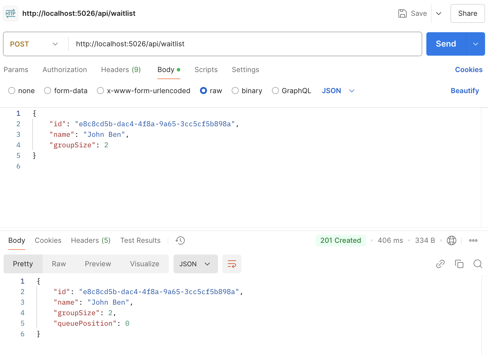
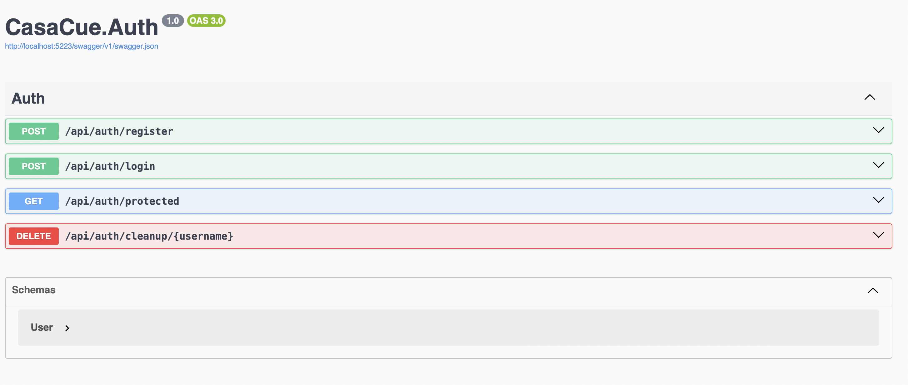
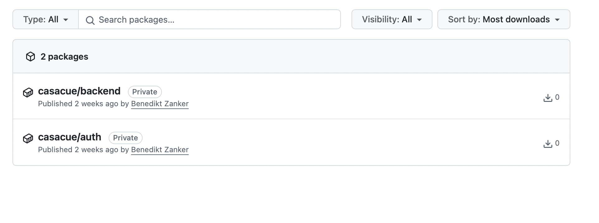

# CasaCue Project Documentation

## Objective
The goal for this milestone was to containerize and publish the CasaCue Waitlist API, Database, and Authentication System, test their functionality, and ensure that they operate as expected.


## Folder Structure
To ensure a well-organized project, a clear folder structure was established to separate the different components of the application:

- **`backend/`**: Contains Docker configuration for the Waitlist API.
- **`database/`**: Placeholder for database integration, configured using a PostgreSQL image in this milestone.
- **`auth/`**: Contains Docker configuration for the Authentication Service.
- **`docker-compose.yaml`**: Located in the root directory for orchestrating multiple services.


## Backend Container

### 1. Creating the Backend Container
A `Dockerfile` was created to containerize the backend API. It specifies the base image and the necessary steps to package the application. Key steps are documented directly in the [Dockerfile](../docker/backend/Dockerfile).

The backend was published using the .NET CLI:
```bash
dotnet publish -c Release -o publish
```
This command generated the required files, which were included in the container. The container was configured to expose the API on port 8080.

### 2. Running the Backend Container Locally
The backend container was started locally with the following command:
```bash
docker run -p 5001:8080 casacue-backend
```
This mapped port 8080 from inside the container to port 5001 on the host system, making the API accessible at `http://localhost:5001`.

### 3. Testing the API with Postman
#### POST /api/waitlist
This endpoint was tested to add a guest to the waitlist. The following JSON payload was sent:
```json
{
    "id": "e8c8cd5b-dac4-4f8a-9a65-3cc5cf5b898a",
    "name": "John Ben",
    "groupSize": 2
}
```
The API successfully added the guest to the waitlist.


 
#### GET /api/waitlist
This endpoint was tested to retrieve the current waitlist, which included the newly added guest:
```json
[
    {
        "id": "e8c8cd5b-dac4-4f8a-9a65-3cc5cf5b898a",
        "name": "John Doe",
        "groupSize": 2
    }
]
```

## Database Integration

### 1. Setting Up PostgreSQL
PostgreSQL was installed and configured as follows:

1. **Installation** (on macOS using Homebrew):
   ```bash
   brew install postgresql
   ```

2. **Starting the Service**:
   ```bash
   brew services start postgresql
   ```

3. **Verifying Installation**:
   ```bash
   psql postgres
   ```

### 2. Configuring the Database

1. **Database and User Setup**:
   ```sql
   CREATE DATABASE casacue_db;
   CREATE USER casacue WITH PASSWORD 'password';
   GRANT ALL PRIVILEGES ON DATABASE casacue_db TO casacue;
   ```

2. **Testing the Connection**:
   ```bash
   psql -U casacue -h localhost -d casacue_db
   ```

### 3. Connecting the Backend to PostgreSQL

1. **Connection String**:
   The connection string was added to the `appsettings.json` file:
   ```json
   {
       "ConnectionStrings": {
           "DefaultConnection": "Host=localhost;Database=casacue_db;Username=casacue;Password=password"
       }
   }
   ```

2. **Configuring `DbContext`**:
   The `ApplicationDbContext` class was defined to represent the database structure:
   ```csharp
   namespace CasaCue.Data
   {
       public class ApplicationDbContext : DbContext
       {
           public ApplicationDbContext(DbContextOptions<ApplicationDbContext> options) : base(options) { }

           public DbSet<Guest> Guests { get; set; }
       }
   }
   ```

3. **Registering `DbContext` in `Program.cs`**:
   ```csharp
   builder.Services.AddDbContext<ApplicationDbContext>(options =>
       options.UseNpgsql(dbConnectionString)
              .LogTo(Console.WriteLine, LogLevel.Information));
   ```

### 4. Creating the Database Schema

1. **Creating a Migration**:
   ```bash
   dotnet ef migrations add InitialCreate
   ```

2. **Applying the Migration**:
   ```bash
   dotnet ef database update
   ```

3. **Verifying the Schema**:
   ```sql
   \dt
   ```

### 5. Viewing and Managing the Database

To simplify database management, **pgAdmin** was installed:

1. **Installation**:
   [pgAdmin Download](https://www.pgadmin.org/download/)

2. **Connecting to PostgreSQL**:
   - **Host**: `localhost`
   - **Port**: `5432`
   - **Database**: `casacue_db`
   - **Username**: `casacue`
   - **Password**: `password`

3. **Viewing Tables**:
   The table `Guests` was selected in pgAdmin to query its contents. 
   After executing several POST requests, the database appeared as follows.


## Authentication and Logging System

### 1. Authentication Logic
An authentication service was added to enable user registration, login, and token-based access to protected routes, to create a third container later. 

1. **API Endpoints in `AuthController.cs`**:
   - `POST /register`: Registers a new user and logs actions.
   - `POST /login`: Authenticates users and generates JWT tokens.
   - `GET /protected`: A protected endpoint accessible only to authenticated users.
   - `DELETE /cleanup/{username}`: Deletes a user from the database.

2. **JWT Token Generation (`JwtService.cs`)**:
   - Generates secure tokens with user-specific claims.
   - Includes expiration and signing credentials.

3. **Integration in `Program.cs`**:
   Configures `JwtBearer` authentication to validate tokens.

### 2. Logging and Testsing
The logging system, using **Serilog**, was added to track key actions for transparency and debugging. Also some Test were added to test the API.




## Containerization of the Authentication Service
The authentication service was containerized similarly to the backend. Details are in the [Dockerfile](../docker/auth/Dockerfile).

## Docker Compose
After working manually with individual containers, a `docker-compose.yaml` file was introduced to orchestrate all services:

- Backend
- Database (PostgreSQL image)
- Authentication Service

To ensure proper startup sequencing of containers during development, the project utilizes the wait-for-it script ([wait-for-it script](https://github.com/vishnubob/wait-for-it)). This script guarantees that dependent services are fully operational before initiating the main application containers.

Detailed descriptions of the file's actions are included directly in the [Docker Compose file](../docker-compose.yaml).


## CI Pipeline Updates
The CI pipeline was updated to include container logic and publishing steps. Every action is precisely documented in the [CI Pipeline file](.github/workflows/ci.yml).

Once the containers are published, they appear in my profile:



## Further Updates
- Tests were rewritten to utilize containers during execution.
- Additional logging and debugging capabilities were integrated caused by issues during developing.


For further details about the project, refer to the main [README](../README.md).