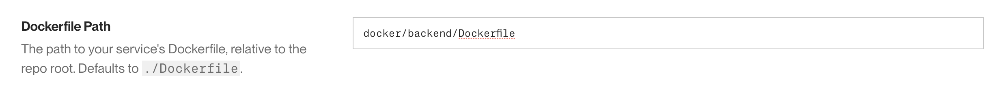
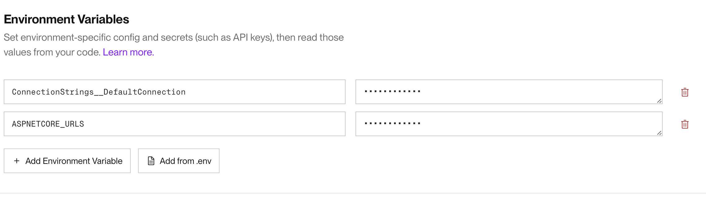
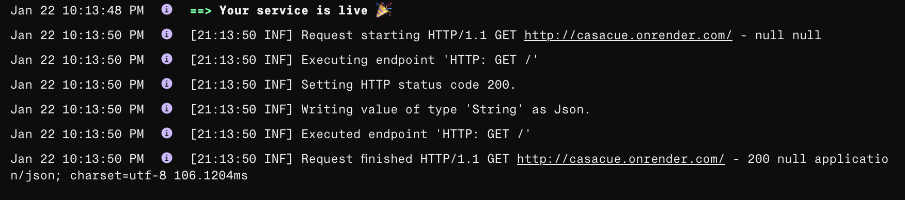
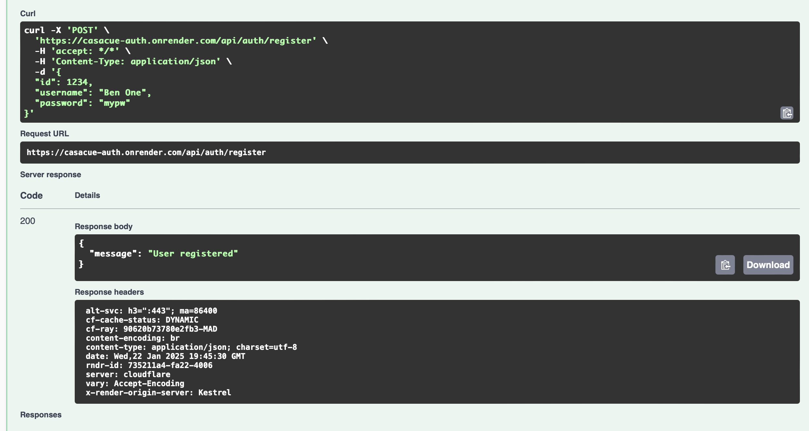
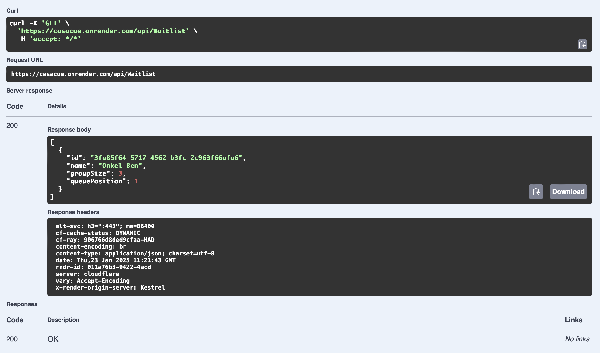

# CasaCue Project Documentation - Hito 5

## 1. Selection and Justification of the PaaS Platform

For the deployment of the project as part of Hito 5, I chose **Render** as the Platform-as-a-Service (PaaS) platform. My selection was based on the following criteria:

### Why Render?
- **Ease of Use:** Render provides an intuitive interface, making configuration straightforward.
- **PostgreSQL Support:** Render simplifies database setup with built-in PostgreSQL integration.
- **Cost-Effectiveness:** The free tier meets my project requirements without additional costs.
- **GitHub Integration:** Seamless deployment directly from GitHub automates updates.
- **Automatic Deployment:** Commits trigger automatic deployments, reducing manual effort.

### Other Platforms Tested
I also considered similar platforms like **Railway**, **Google Cloud**, and **Azure**, but I found them less intuitive for my project. Render’s simplicity and efficient workflow made it the best choice.


## 2. Preparing the Project

To better test functionality, I added a startup message to the `Program.cs` files of my containers. This message is displayed when the API is accessed:
```csharp
app.MapGet("/", () => Results.Ok("Welcome to CasaCue Backend API!"));
```

Additionally, I enabled Swagger for production to facilitate testing of the APIs:
```csharp
if (app.Environment.IsDevelopment() || app.Environment.IsProduction())
{
    app.UseSwagger();
    app.UseSwaggerUI();
}
```

With these adjustments, my project was ready to be uploaded.

## 3. Deployment Process

### Step 1: PostgreSQL Database
First, I created a PostgreSQL database using the "New" menu in Render. I selected a free plan and filled fields such as user and database with appropriate values. In my `docker-compose` file, this database was referenced as being created from an image. However, due to deployment issues, I decided to create the database manually instead of letting the `docker-compose` handle it.

### Step 2: Deploying the API Containers
Next, I deployed the API containers by creating web services in Render. Using the previously connected GitHub integration, I linked the respective Dockerfiles for deployment.

### Step 3: Configuring Environment Variables
To ensure the APIs connect correctly to the database, I created two environment variables in Render:
- `ConnectionStrings__DefaultConnection`: Used to override the connection strings in my project to match the manually created database.
- `ASPNETCORE_URLS`: Ensures the application binds to the correct port and URL for Render's infrastructure.

These configurations ensured a seamless connection between the APIs and the database. 


## 4. Testing the Application

To test the application, I accessed the two websites provided after deployment:
- [Auth API](https://casacue-auth.onrender.com)
- [Backend API](https://casacue.onrender.com)

Upon visiting these URLs, the configured startup messages from Step 1 were displayed:
- **Auth API:** "Welcome to CasaCue Auth API!"
- **Backend API:** "Welcome to CasaCue Backend API!"


### Swagger Testing
I also activated Swagger, which I can now use to test the APIs. Swagger can be accessed via the following URLs:
- [Backend API Swagger](https://casacue.onrender.com/swagger/index.html)
- [Auth API Swagger](https://casacue-auth.onrender.com/swagger/index.html)

Using Swagger, I tested the API endpoints and confirmed that the responses were successful. As demonstrated in the following examples, I performed GET and POST operations to confirm the API and database functionality:




For further details about the project, refer to the main [README](../README.md).